# TOWNKART

### AI-Powered Local Commerce for Smarter, Sustainable Shopping

  
  
  
  
  
  
  

---

**Team Name:** [VIBING CODERS]

**Members:**

* [Hanisha Govindaraj]
* [Nabihg Noorul Ashika]
* [Zohra Fakrudeen Ali]
  
# Problem Statement

Local commerce faces a fundamental product-discovery problem.

Customers often know what they need, but finding the right product from the right nearby store can be unnecessarily difficult. Users may have to visit multiple shops, make several calls, compare prices manually, and determine whether sufficient stock is available.

The problem becomes more significant when users search using natural or regional terminology.
## TownKart

**TownKart** is an AI-powered local commerce platform designed to help users discover relevant products from nearby local stores while considering price, availability, distance and sustainability.

### Core Flow

**Natural Language Query → AI Understanding → Product Matching → Local Inventory → ML Ranking → Sustainable Recommendation**

---

##  Key Features

*  AI-powered natural-language shopping
*  Local store discovery
*  Budget-aware recommendations
*  Real-time inventory-based matching
*  Distance-aware recommendations
*  ML-based matching
*  Sustainability-aware ranking
*  Green Points incentive system
*  AI-generated recommendation explanations

---

## Technology Stack

TownKart uses a combination of artificial intelligence, machine learning, backend services, cloud database technology, geolocation and Android development to create an intelligent local-commerce platform.

| Technology | Role in TownKart |
|------------|------------------|
| Python | Core backend and AI/ML development |
| FastAPI | REST API and backend service layer |
| Google Gemini | Natural-language understanding and query interpretation |
| Firebase | Real-time inventory and store data management |
| Scikit-learn | Machine-learning-based store matching and ranking |
| Pandas | Dataset processing and preparation |
| Joblib | Machine-learning model serialization |
| Uvicorn | ASGI server used to run the FastAPI backend |
## Demo

## 🎥 Demo

## 🎥 Demo

  

---
##  System Architecture

```mermaid
flowchart LR
    A[User Query] --> B[Gemini Query Parser]
    B --> C[Structured Query]
    C --> D[Product Normalizer]
    D --> E[Firebase Inventory]
    E --> F[Availability and Budget Check]
    F --> G[Distance Calculation]
    G --> H[ML Match Predictor]
    H --> I[Match Score]
    I --> J[Recommendation Ranking]
    J --> K[Explanation Generator]
    K --> L[Recommended Stores]
```

### Architecture Components

| Component                       | Function                                                             |
| ------------------------------- | -------------------------------------------------------------------- |
| **User Query**                  | Accepts natural-language shopping requests                           |
| **Gemini Query Parser**         | Converts natural language into structured shopping parameters        |
| **Structured Query**            | Extracts product, quantity, budget and preferences                   |
| **Product Normalizer**          | Standardizes product names, quantities and units                     |
| **Firebase Inventory**          | Stores local-store products, prices and availability                 |
| **Availability & Budget Check** | Filters products based on stock and budget                           |
| **Distance Calculation**        | Determines distance between user and stores                          |
| **ML Match Predictor**          | Predicts how well a product/store matches the request                |
| **Match Score**                 | Combines relevance, price, availability, distance and sustainability |
| **Recommendation Ranking**      | Ranks the best available local stores                                |
| **Explanation Generator**       | Generates an AI explanation for each recommendation                  |
| **Recommended Stores**          | Displays the final ranked recommendations                            |

---

## 🌱 Sustainability

TownKart promotes sustainable local commerce by prioritizing recommendations that can reduce unnecessary travel and encourage users to support nearby businesses.

### Green Points

Users can earn **Green Points** for sustainable shopping decisions.

These points can encourage:

* Choosing nearby stores
* Supporting local businesses
* Selecting sustainable products
* Reducing unnecessary travel
* Making environmentally conscious purchases

The goal is to turn sustainability into a **visible and measurable incentive** rather than simply giving users environmental information.

---

## Scalability

The architecture is designed to scale from a prototype into a larger local-commerce ecosystem.

* Firebase provides scalable inventory management.
* The backend can support additional APIs.
* The ML model can be retrained using real-world transaction data.
* Additional stores and cities can be added to the inventory.
* WhatsApp can be added as an additional interface.
* Recommendation factors can be expanded without changing the complete architecture.

---

## Future Scope

* WhatsApp shopping assistant
* Real-time inventory synchronization
* UPI/payment integration
* Advanced sustainability scoring
* Personalized shopping history
* Multilingual voice interaction
* Dynamic offers and discounts
* Expansion across multiple cities

